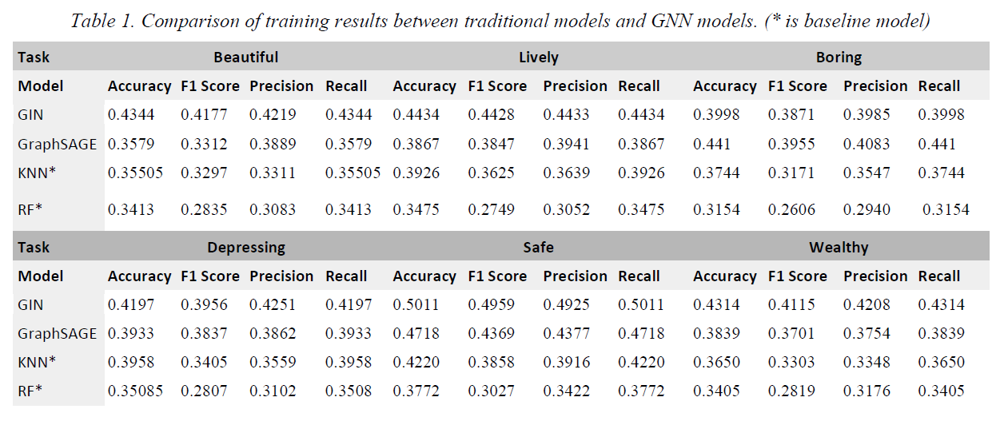

# Perception Prediction Model

## Contents

- [Introduction](#Introduction)
- [Overview](#Overview)
- [Instructions](#Instructions)
- [Acknowledgements](#Acknowledgements)
- [Contact](#Contact)

## Introduction

SyncPerception (SP) is a Grasshopper plugin for Grasshopper based on GNN model training. It can predict citizens' perception scores in six dimensions of beauty, safety, vitality, affluence, boredom, and depression in real time, simulating human visual perception of urban scenes. It proposes a dynamic method to incorporate citizens' perspectives into urban planning, providing a practical solution for promoting inclusive and people-oriented urban development.

## Overview

## Instruction

This project has tree main step: data processing, model training and explainer training.

## Acknowledgements

Thanks to my collaborators Shangyu Lou. She has made great contributions to methodology, data processing and model training.

## Contact

If you have any question, be free to contact me: ziqi.cui@polimi.it
